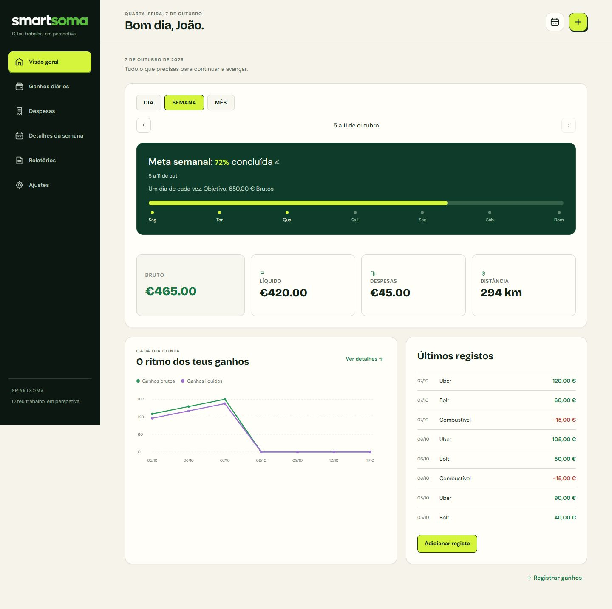

# Migração visual SmartSoma

## Referência e proteção

- Base local/remota: `bdff00f4da2096cb0212bc4a05cf18878d1cc128`.
- Produção anterior: `https://smartsoma-in8x51ljv-smart-soma.vercel.app`.
- Trabalho isolado: `codex/interface-migration`.
- O mockup é referência visual, não uma fonte de regras de negócio.
- Manter login, recuperação, OAuth, subscrição/Creem, permissões, fila offline,
  chaves persistidas, fórmulas e relatórios existentes.
- Sem migrações de base de dados, alterações de políticas ou funções Supabase.

## Etapas

1. Referência versionada e testes de regressão da implementação existente.
2. Identidade visual, navegação e layouts responsivos sobre os componentes reais.
3. Visão geral, gráfico bruto/líquido, registo rápido e páginas auxiliares.
4. Regressão automática, verificação visual, versão de pré-produção.
5. Publicação da versão verificada e verificação dos URLs de produção.

Cada etapa tem um commit independente. Qualquer falha interrompe a passagem
para a etapa seguinte até ser corrigida ou documentada como bloqueio.

## Contratos que não podem mudar

- `cloud-init.js` continua a autenticar e hidratar antes de executar `app.js`.
- `homeBadgeValores:AAAA-MM-DD`: um valor diário por plataforma; corrigir
  substitui o valor, não cria uma segunda receita.
- `despesasDiarias:*`, `despesasFixas`, vigência e opção de ignorar a semana
  continuam a ser lidas pelo motor original.
- Distância total e odómetro inicial/final conservam validações e persistência.
- IDs dos elementos originais e listeners são preservados.
- Eliminações, alteração de email/password e subscrição usam os fluxos reais.

## Verificação

Os testes DOM usam dados em memória, sem chamadas ao Supabase. Não constituem
prova de uma cobrança real ou de uma sessão autenticada em produção. Esses
limites devem ser explicitados no relatório, sem chamar simulação de teste E2E.

## Reversão

Manter disponível o deployment anterior. Em caso de regressão de produção,
repor esse deployment na Vercel e corrigir antes de nova promoção. Os dados
persistidos não precisam de migração reversa, pois o seu formato não muda.

## Verificação de integração — 7 de outubro

- 29 testes: registo por plataforma, substituição diária, despesas avulsas e
  fixas, percentagens, quilometragem/odómetro, datas anteriores, histórico,
  meta e celebração, navegação, preferências, FAQ e geração com jsPDF real.
- O arranque usa `cloud-init.js` real com um cliente Supabase simulado:
  hidratação, utilizador validado, carregamento tardio de app.js, fila de
  gravação e reconexão offline são exercitados sem tocar em contas reais.
- Seis cenários do controlo original de subscrição: ativa, trial, cancelada
  dentro do período pago, expirada, ausente e erro do servidor.
- Hashes confirmam que login, persistência, checkout, webhook, eliminação
  de conta e todos os scripts inline de autenticação/subscrição estão intactos.
- Os novos totais da visão geral e o gráfico reutilizam o cálculo existente
  da tabela semanal, incluindo despesas fixas, sem regravar o cache.
- A interface aguarda a inicialização dos controlos originais; a navegação
  cancela transições anteriores para evitar sobreposição de páginas.
- Cache offline v6 inclui ui-v2.js/css. Testes passam também a executar no CI.
- Testes, mockup, documentação, fontes das funções Supabase, ficheiros de
  ambiente e cópias ZIP não são enviados para a publicação Vercel.
- Verificação visual em mobile/desktop, modos claro/escuro, registo rápido,
  quilometragem, tabela semanal, ajustes, perfil e ajuda.

Limite: a suite usa dados e respostas de autenticação/subscrição sintéticos.
Não foi realizada uma cobrança, eliminação, alteração de password nem gravação
numa conta real. A inspeção pública de produção não substitui estes testes.

## Publicação concluída

- Fonte da versão publicada: `1c2e8f4ee3d82a78fc92933d53d82e1fbb20b96f`.
- Deployment: `dpl_CwNkRZUS8bmobcGbkzk6EmjA5pKa` — estado Ready.
- URL imutável: https://smartsoma-buz1not8a-smart-soma.vercel.app
- Aplicação: https://www.smartsoma.pt/app
- Compilação: 15 segundos reportados por `vercel inspect`.
- Criada com `--prod --skip-domain`, verificada e promovida sem reconstrução.
- 16 verificações HTTP passaram na versão protegida e no domínio público:
  sete ficheiros idênticos à fonte local, páginas e recursos 200, três áreas
  excluídas 404, GET rejeitado com 405 nos dois endpoints de escrita.
- Navegador sem sessão: `/app` redireciona para `/login`; formulário,
  recuperação e botão Google presentes. Nenhuma credencial foi utilizada.
- Consulta de erros Vercel após publicar: nenhum registo devolvido no intervalo.
  Isto não comprova ausência de erros em todos os clientes, nem monitora Supabase.
- Auditoria `npm audit --omit=dev --audit-level=high`: zero vulnerabilidades.

Para repetir o smoke test público, na raiz do projeto:
`./tests/smoke-release.ps1 -Deployment https://www.smartsoma.pt`

Para reverter para a versão anterior, se necessário:
`vercel promote https://smartsoma-in8x51ljv-smart-soma.vercel.app --scope team_6op6ddx7P3EyXYgyjX2amOv6`

